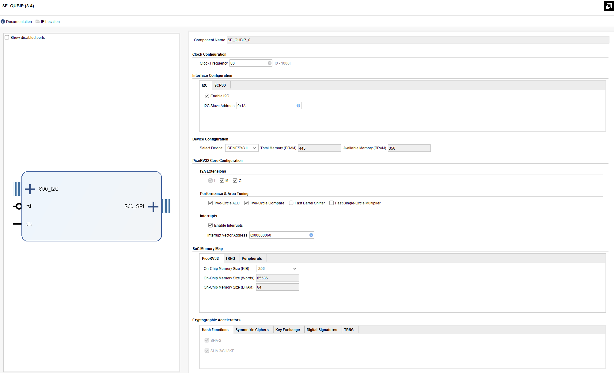
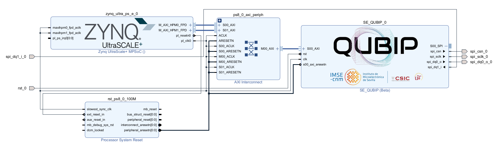
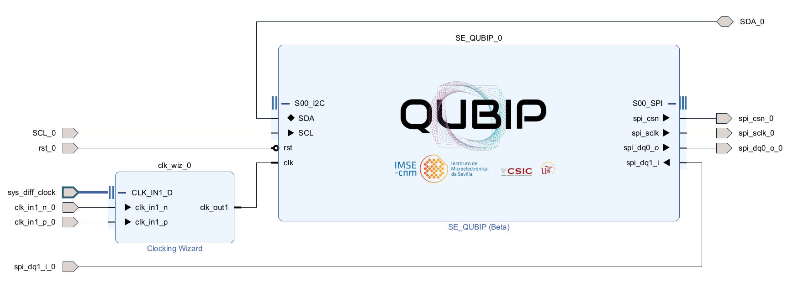
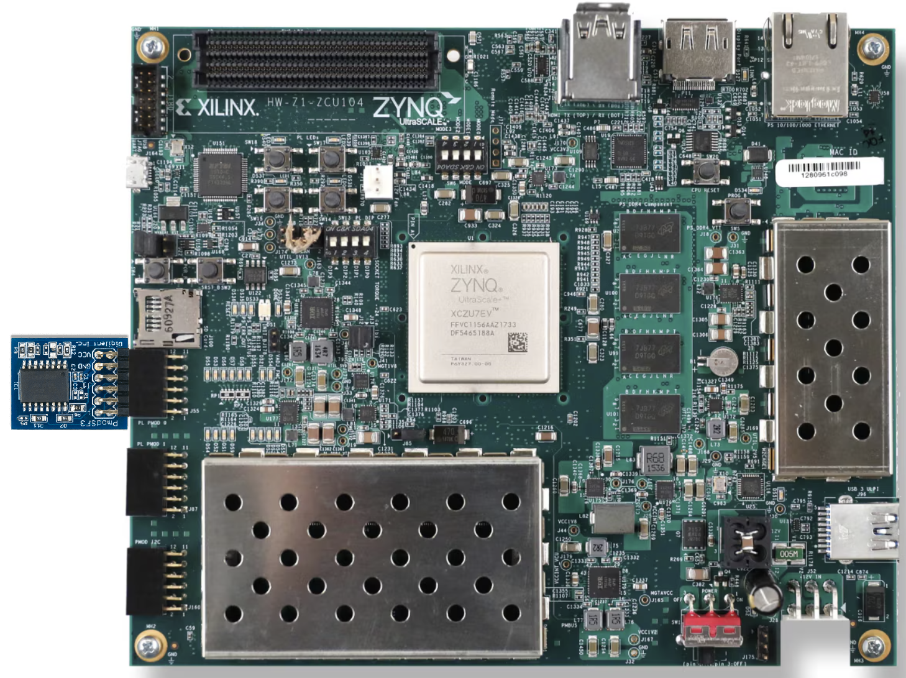
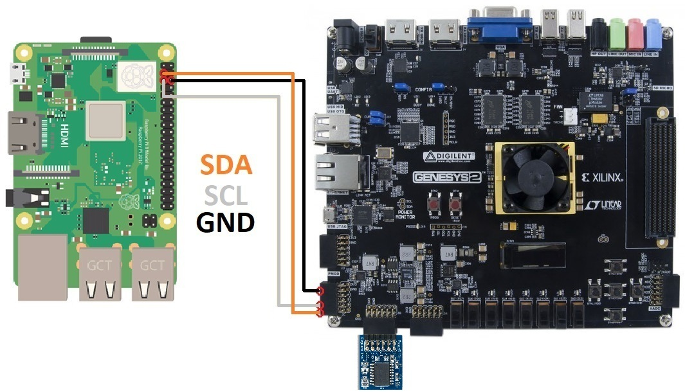
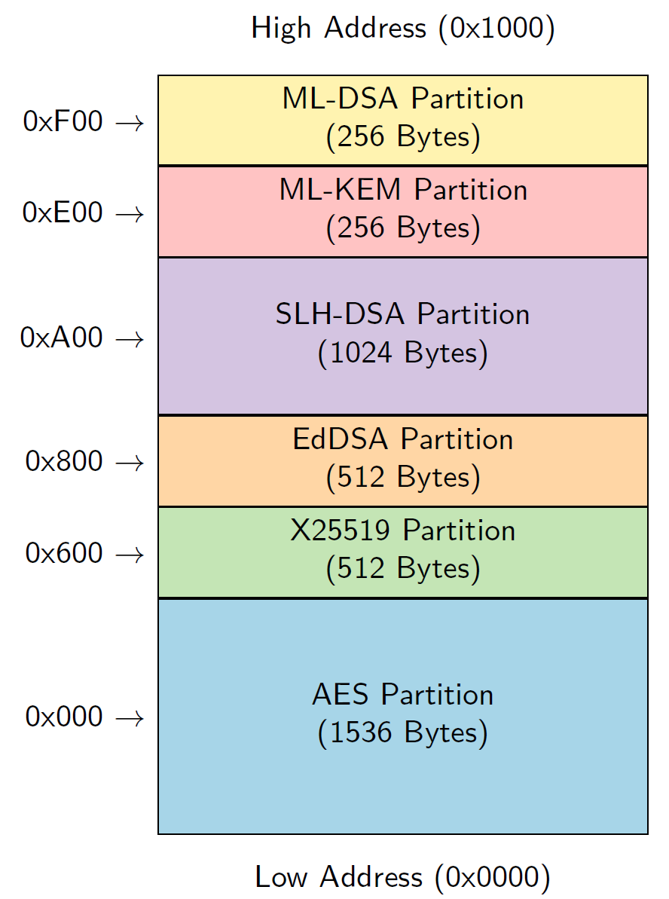

# SE-QUBIP

## Introduction

This is the repository of the Secure Element (SE) developed by CSIC-IMSE team within QUBIP project.  

## Description

The content of the SE-QUBIP library is depicted in the next container tree:
    
    .
    ├── se-qubip            # folder that contains all the files of the SE.
        .
        ├── bit             # folder to store the bitstream files
        ├── build           # folder to store the shared libraries 
        ├── fw              # folder to store the firmware 
        └── rtl             # folder that contains the RTL sources files
            .
            ├── common      # common files 
            ├── sha3        # SHA3 files 
	        ├── sha2        # SHA2 files 
            ├── eddsa       # EdDSA files
	        ├── x25519      # X25519 files
            ├── trng        # TRNG files
            ├── aes         # AES files
            ├── mldsa       # MLDSA files
            ├── slhdsa      # SLHDSA files
            └── mlkem       # MLKEM files	    	
        └── src             # folder that contains the sources files of the library
            .
            ├── common      # common files 
            ├── sha3        # SHA3 files 
	        ├── sha2        # SHA2 files 
            ├── eddsa       # EdDSA files
	        ├── x25519      # X25519 files
            ├── trng        # TRNG files
            ├── aes         # AES files
            ├── mldsa       # MLDSA files
            ├── slhdsa      # SLHDSA files
            ├── spi         # SPI files
            ├── secmem      # SECMEM files
            └── mlkem       # MLKEM files 
        └── xdc             # folder that contains the constraints
    ├── demo                # folder that contains the demo
    ├── img                 # folder that contains images
    ├── results             # folder that contains the results
    ├── se-qubip.h          # header of the library
    ├── Makefile            # To compile the library
    ├── LICENSE             # License File
    ├── SE_QUBIP_v3.3.zip   # The IP Module of the Secure Element
    └── README.md  

For now (***v3.3***) the list of supported algorithms are:

| Sym. Enc. I   | Sym. Enc. II   | Hash          | EC            | RNG           | PQC  I               | PQC  II               | PQC  III           |
| --------      | --------       | ---------     | -------       | -------       | -------              | -------               | --------           |
| AES-128-ECB   | AES-192-CCM-8  | SHA-256       | EdDSA25519    | TRNG          | MLKEM-512            | SLHDSA-SHAKE-192-F    | SLHDSA-SHA-2-256-F |
| AES-128-CBC   | AES-192-GCM    | SHA-384       | X25519        |               | MLKEM-768            | SLHDSA-SHAKE-192-S    | SLHDSA-SHA-2-256-S |            
| AES-128-CMAC  | AES-256-ECB    | SHA-512       |               |               | MLKEM-1024           | SLHDSA-SHAKE-256-F    |                    |
| AES-128-CCM-8 | AES-256-CBC    | SHA-512/256   |               |               | MLDSA-44             | SLHDSA-SHAKE-256-S    |                    |                           
| AES-128-GCM   | AES-256-CMAC   | SHA3-256      |               |               | MLDSA-65             | SLHDSA-SHA-2-128-F    |                    |                       
| AES-192-ECB   | AES-256-CCM-8  | SHA3-512      |               |               | MLDSA-87             | SLHDSA-SHA-2-128-S    |                    |
| AES-192-CBC   | AES-256-GCM    | SHAKE128      |               |               | SLHDSA-SHAKE-128-F   | SLHDSA-SHA-2-192-F    |                    |
| AES-192-CMAC  |                | SHAKE256      |               |               | SLHDSA-SHAKE-128-S   | SLHDSA-SHA-2-192-S    |                    |


## Interface

### Vivado IP Integrator

#### SE-QUBIP Interface

The SE_QUBIP (v3.3) IP module offers a detailed configuration interface within the Vivado IP Integrator. The configuration is divided into several key sections:

*   **Clock Configuration**: It is **mandatory** to set the `Clock Frequency` for the IP core. This parameter is critical for the correct operation of the internal logic and timing.

*   **Interface Configuration**: The IP block provides both I2C (`S00_I2C`) and AXI (`S00_AXI`) interfaces for communication. The I2C interface can be enabled or disabled, and its slave address can be configured.

*   **Device and Memory Configuration**: Users can select the target `Device` (e.g., GENESYS II), which displays the `Total Memory (BRAM)` available and the amount consumed by the current IP configuration. The `On-Chip Memory Size` for the PicoRV32 core can also be adjusted under the `SoC Memory Map`.

*   **PicoRV32 Core Configuration**: The module is built around a PicoRV32 RISC-V core, which has several configurable parameters, including ISA Extensions, Performance & Area Tuning, and Interrupt settings. **Warning:** It is strongly recommended not to modify the default PicoRV32 core settings. The firmware provided for the IP is specifically compiled and optimized for this default hardware configuration, and any changes may lead to system instability or malfunction.

*   **Cryptographic Accelerators**: A variety of cryptographic hardware accelerators can be independently selected for implementation. These are organized into logical tabs: Hash Functions (SHA-2, SHA-3/SHAKE), Symmetric Ciphers, Key Exchange, Digital Signatures, and TRNG.

The following figure illustrates this comprehensive configuration interface in Vivado:


#### ZCU104 Block Diagram

For **ZCU104 platform** include the Zynq UltraScale+ MPSoC IP in the block diagram  and **set the clock frequency to 350 MHz**, together with the constraint file **zcu104.xdc** which can be found at **/se-qubip/rtl/xdc/** folder.



#### Genesys II Block Diagram

For **Genesys II platform** include the Clocking Wizard IP and **set the clock frequency to 80 MHz**, together with the constraint file **genesys_ii.xdc** which can be found at **/se-qubip/rtl/xdc/** folder.



### AXI-Lite (MPU flavour)

The AXI-Lite drivers are described using the PYNQ API interface. To use the SE in the MPU IoT device, it is mandatory to have installed this interface. In the case, the developers desire to test the SE in **PYNQZ2 platform** should follow the next steps to install the PYNQ API repository:  

1. Download the PYNQ C-API from [here](https://github.com/mesham/pynq_api/). 

2. To modify the clock frequency (it is mandatory for the demo) you must edit the file ```src/pynq_api.c``` to replace **0x00** with **address** on _line 327_:

```c
    // return PYNQ_writeMMIO(&(state->mmio_window), &write_data, **0x00**, sizeof(unsigned int));
    return PYNQ_writeMMIO(&(state->mmio_window), &write_data, **address**, sizeof(unsigned int));
```

3. Then, issue ```make```. Once it is built, issue ```sudo make install```. 

By default, within the QUBIP project, the platform to be used will be the **ZCU104**. For that, the developers just have to follow the instructions of the modified PYNQ API [here](https://gitlab.com/hwsec/pynq-api-ultrascale).

#### Pin Connections

The following diagram shows the I/O connections between the **ZCU104 board** and the **PmodSF3** flash memory:



### I2C (MCU flavour)

The **I2C Slave Interface** enables communication between a master device (such as a **Raspberry Pi 4B**) and the SE-QUBIP platform, allowing for read and write operations with the cryptographic IP cores. It supports several key features including glitch filtering and dynamic configuration.

#### Key Features
- **Device Address**: The I2C address is set to `0x1A` by default.
- **Supported Cryptographic Cores**: SHA-3, SHA-2, AES, EDDSA, X25519, TRNG, MLKEM.
- **Glitch Filtering**: Configurable filtering for cleaner signal transmission, with dynamic adjustments possible via registers:
  - **Register `0xFD`**: Zero-threshold filter value.
  - **Register `0xFE`**: One-threshold filter value.
  - **Register `0xFF`**: Filter width value.

#### I2C Communication and Configuration
- **SCL & SDA Lines**: The I2C communication takes place over the **SCL** (clock) and **SDA** (data) lines, which are synchronized and filtered to detect start/stop conditions and maintain stable data exchange.
- **State Machine (FSM)**: Manages the I2C protocol flow, including address recognition, data transmission, and synchronization with the Raspberry Pi.
- **Data Registers**: Internal registers store data from the master writes and provide output for read operations.
- **Configuration Registers**: Support dynamic adjustments in communication behavior and glitch filtering.

#### Raspberry Pi 4B as Master
The Raspberry Pi 4B, acting as the I2C master, controls the communication via its built-in Linux I2C libraries. It generates the clock signals and manages data transmission, sending start conditions, addressing the FPGA, and performing read/write operations according to the I2C protocol. To enhance performance and reduce latency during data-intensive operations, the bus frequency has been configured to **1 MHz**. This modification allows for up to ten times faster communication compared to the standard I2C speed, optimizing the overall system throughput.

#### Pin Connections

The following diagram shows the I/O connections between the **Raspberry Pi 4B**, the **Genesys Board II**, and the **PmodSF3** flash memory:



### Secure Memory

The SE-QUBIP includes a dedicated 4 KB on-chip memory block designed for the secure management of cryptographic keys. This memory is volatile and its contents are lost when the device is powered off. It is organized into distinct slots, each allocated to a specific cryptographic algorithm to prevent unauthorized access and ensure data integrity.

#### Memory Layout

The Secure Memory is partitioned to store keys for different cryptographic algorithms. Each partition has a fixed size, a maximum number of key slots, and a defined key length. The firmware manages this layout internally to ensure that keys for one algorithm cannot overwrite or access the memory space of another.

The following table and diagram illustrate the memory organization:

| Algorithm | Key Size (Bytes) | Max Keys | Address Offset | Total Size (Bytes) |
| :--- | :--- | :--- | :--- | :--- |
| AES | 32 | 48 | `0x000` | 1536 |
| X25519 | 64 | 8 | `0x600` | 512 |
| EdDSA | 64 | 8 | `0x800` | 512 |
| SLH-DSA | 128 | 8 | `0xA00` | 1024 |
| ML-KEM | 32 | 8 | `0xE00` | 256 |
| ML-DSA | 32 | 8 | `0xF00` | 256 |




#### API Functions

The API functions manage cryptographic keys within the device's volatile memory. Most functions require an algorithm identifier (`alg_id`) to specify the key type (e.g., `ALG_AES`, `ALG_X25519`) and a `key_id` to select a specific key slot. All operations are performed through a specified communication `interface` (AXI or I2C).

**1. Store a Key**

This function stores a key for a given `alg_id`. It can either generate a new key internally (if `is_external` is `false`) or store an externally provided key from the `key_external` buffer, whose length is specified by `key_len`. Upon completion, the function returns the slot's `key_id`.

```c
void secmem_store_key(uint8_t alg_id, uint8_t* key_id, bool is_external, uint8_t* key_external, uint8_t key_len, INTF interface);
```

**2. Get a Key**

Retrieves a key specified by its `key_id` and `alg_id`, copying the key's data into the provided `key_data` buffer.

```c
void secmem_get_key(uint8_t alg_id, uint8_t key_id, uint8_t* key_data, INTF interface);
```

**3. Delete a Key**

Deletes the key specified by `key_id` for the given `alg_id` and clears the memory.

```c
void secmem_delete_key(uint8_t alg_id, uint8_t key_id, INTF interface);
```

**4. Get Secure Memory Info**

Prints a summary of the Secure Memory status. If the debug level `DBG` is set to a value greater than zero, it will also print the actual values of the stored keys.

```c
void secmem_info(int DBG, INTF interface);
```

**5. Delete All Keys**

Securely deletes all keys currently stored in every partition of the Secure Memory.

```c
void secmem_delete_all_keys(INTF interface);
```

### Non-volatile SPI Flash Memory

To ensure key persistence across power cycles, the SE-QUBIP provides an interface to an external SPI flash memory module (e.g., **PmodSF3**). This allows the entire state of the Secure Memory to be saved and restored. Additionally, the interface can be used to store and retrieve arbitrary user data.

#### API Functions

The following functions are available for interacting with the SPI flash memory.

**1. Save Secure Memory State to Flash**

Saves the entire 4 KB state of the Secure Memory to a predefined location in the external SPI flash.

```c
void save_secmem_flash(INTF interface);
```

**2. Recover Secure Memory State from Flash**

Restores the Secure Memory state from the SPI flash, overwriting any content currently in the volatile memory.

```c
void recover_secmem_flash(INTF interface);
```

**3. Save User Data to Flash**

Writes a block of custom user data to the SPI flash. The function takes a pointer to the input data (`data_in`), its length (`data_len`), and the target starting `addr` in the flash memory.

```c
void save_data_flash(unsigned int addr, unsigned int data_len, unsigned char* data_in, INTF interface);
```

**4. Recover User Data from Flash**

Reads a block of data from the SPI flash. It reads `data_len` bytes starting from the specified `addr` and stores the result in the `data_out` buffer.

```c
void recover_data_flash(unsigned int addr, unsigned int data_len, unsigned char* data_out, INTF interface);
```


## Installation

### Makefile Configuration

The SE-QUBIP library is ready to perform the communication to the hardware through two different interfaces: AXI-Lite and I2C. All this implementation has been done through the `INTF` variable into the code. 
To select this configuration during the compilation process, it is ***mandatory*** to change the variable `INTERFACE` (`AXI` or `I2C`) and `BOARD` (`ZCU104` or `PYNQZ2`). If `INTERFACE = I2C`, then the variable `BOARD` is not applied.

### Library Installation

For the installation, it is necessary to follow the next steps: 

1. Download the repository
```bash
sudo git clone https://gitlab.com/hwsec/se-qubip
```

2. You can generate the shared libraries directly after the downloading and use them in any other program. For that, 
```bash
make build
```
The shared libraries will be generated in `se-qubip/build/` folder. 

It might be necessary to add the output libraries to the `LD_LIBRARY_PATH`. In our case: 
```bash
export LD_LIBRARY_PATH=$LD_LIBRARY_PATH:/home/xilinx/se-qubip/se-qubip/build
```

3. There is also possible to install the library into the system local folder. For that, 
```bash
make install
```

4. In case it was necessary to remove the old version of the SE-QUBIP library already installed in the system folder type:
```bash
make uninstall
```

You can skip this step and go directly to the `demo` section. 

## Demo

It has been implemented different type of demo:
- `demo`: the basic demo is working just showing the functionality of the SE. It will return a ✅ in case the implemented algorithm is working properly or ❌ in other case.
- `demo-speed`: The results will show performance in term of Elapsed Time (ET) of each cryptograhic algorithm. 
- `demo-acc`: It will return the HW acceleration versus the SW implementation of the algorithms for different flavours already presented in [CRYPTO_API](https://gitlab.com/hwsec/crypto_api_sw). 

For the use type `make XXX-YYY` where `XXX` and `YYY` can be: 

| XXX                   | Meaning   |
| ----------            | --------- |
| demo                  | Functionality Demo                                        |
| demo-speed            | Execution Time Demo                                       |
| demo-acc-openssl      | HW Acceleration vs OpenSSL flavour of [CRYPTO_API](https://gitlab.com/hwsec/crypto_api_sw)           |
| demo-acc-mbedtls      | HW Acceleration vs MbedTLS flavour of [CRYPTO_API](https://gitlab.com/hwsec/crypto_api_sw)           |
| demo-acc-alt          | HW Acceleration vs ALT flavour of [CRYPTO_API](https://gitlab.com/hwsec/crypto_api_sw)               |

| YYY           | Meaning   |
| ----------    | --------- |
| all           | Local compilation of the whole SE-QUBIP library                    |
| build         | Use of the local shared libraries in build/ folder                 |
| install       | Use of the *already* installed library in the system local folder  |

*Note: To perform the acc test it is ***mandatory*** to have installed the [CRYPTO_API](https://gitlab.com/hwsec/crypto_api_sw) library*.

It is possible to change the behaviour of demo with the file ```config.conf```. The variables ```SHA-2```, ```SHA-3```, etc. represent the type of algorithm to be tested. If ```1``` is set the test will be performed, while a ```0``` will point out that this test won't be performed. The variable ```N_TEST``` set the number of test to be performed to calculate the average execution time.  

For any demo it is possible to type `-v` or `-vv` for different verbose level. For example, `./demo-install -vv`. *We do not recommend that for long test.*  

## Results of Performance

***Results of SE will be published soon.***

<!-- 
The next section describe the average Execution Time of different platforms and libraries of the cryptography algorithms after ***1000*** tests. This results are shown in the `results` folder.  

| Plattform         | Speed Test                                | acc vs OpenSSL 3                          | acc vs MbedTLS                            | acc vs ALT                                    |
| ----------        | ---------                                 | -------                                   | ---------                                 | ---------                                     |
| **Pynq-Z2** *(AXI)*  | TBD                             | TBD     | TBD      |TBD                             |
| **ZCU-104** *(AXI)*           | [link](results/zcu104/zcu104_speed.txt)   | <a href="https://hwsec.gitlab.io/se-qubip/zcu104/zcu104_acc_openssl.html" target="_blank">link<a> | TBD | <a href="https://hwsec.gitlab.io/se-qubip/zcu104/zcu104_acc_openssl.html" target="_blank">link</a>  |
| **Genesys2** *(I2C)*           | TBD                                            | TBD                                        | TBD      | TBD                                           |

\* _TBD: To Be Done_
-->

## Contact

**Eros Camacho-Ruiz** - (camacho@imse-cnm.csic.es)

_Hardware Cryptography Researcher_ 

_Instituto de Microelectrónica de Sevilla (IMSE-CNM), CSIC, Universidad de Sevilla, Seville, Spain_

**Pablo Navarro-Torrero** - (navarro@imse-cnm.csic.es)

_Hardware Cryptography Researcher_ 

_Instituto de Microelectrónica de Sevilla (IMSE-CNM), CSIC, Universidad de Sevilla, Seville, Spain_

## Developers

Eros Camacho-Ruiz, Pablo Navarro-Torrero, Pau Ortega-Castro, Apurba Karmakar

_Instituto de Microelectrónica de Sevilla (IMSE-CNM), CSIC, Universidad de Sevilla, Seville, Spain_

## Note 

The .html files of results have been generated with this command: 

```bash
sudo apt-get install colorized-logs
./demo-acc-alt-all | ansi2html > output.html
```
